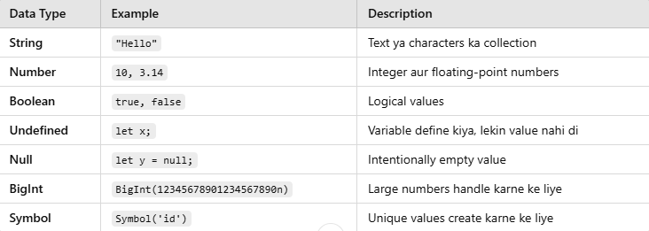
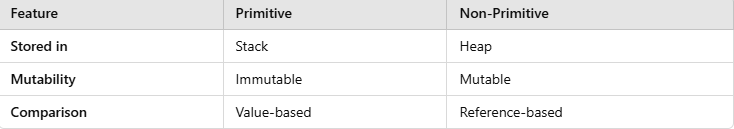

# Javascript Interview

**Basic Level**

1. JavaScript aur ECMAScript me kya farq hai?
2. let, const, aur var me kya differences hain?
3. JavaScript me data types kaun kaun se hain?
4. \== aur === me kya difference hai?
5. JavaScript me hoisting kya hoti hai?
6. null aur undefined me kya fark hai?
7. Arrow functions aur normal functions me kya difference hai?
8. Template literals kya hote hain, aur kaise use karte hain?
9. map(), filter(), aur reduce() methods me kya difference hai?
10. Spread operator (...) aur rest parameter (...) ka kya use hai?

**Intermediate Level**

1. Callback function kya hoti hai?
2. Event loop kaise kaam karta hai?
3. Event delegation kya hoti hai?
4. JavaScript me closures kya hote hain? Example ke sath samjhao.
5. Asynchronous programming kya hoti hai, aur JavaScript me kaise implement hoti hai?
6. setTimeout aur setInterval kaise kaam karte hain?
7. Promises aur async/await me kya difference hai?
8. Local storage aur session storage me kya difference hai?
9. JavaScript me deep copy aur shallow copy kya hoti hai?
10. Debouncing aur throttling kya hoti hain, aur kab use hoti hain?

**Javascript**

1. **JavaScript aur ECMAScript me kya farq hai?**

**ECMAScript:**

ECMAScript aik standard h jo javascript aur dusri scripting languages ke rules aur features ko define karti h. Iska ka kaam javascript ke syntax, functions aur behavior ko standardize karna hai.

**Javascript:**

Javascript aik scripting language h jo ECMAScript ke standard ko follow karti h. Javascript web development, backend development aur app development ke liye use hoti h.

Javascript is a single threaded, non blocking asynchronous concurrent language

#### **Example:**

ECMAScript ke naye versions (e.g., ES6, ES7, ES8) naye features introduce karte hain, jo baad mai JavaScript engines (e.g., V8, SpiderMonkey) implement karte hain.\
Jaise **ES6 (ECMAScript 2015)** ne **let, const, arrow functions, classes, template literals** jaise naye features introduce kiye.

1. **let, const, aur var me kya differences hain?**

#### var **(Re-declaration & Re-assignment Allowed)**

var ko **dobara declare bhi kar sakte hain aur dobara value assign bhi kar sakte hain.**

var function-scoped hota hai, is wajah se ye **block scope follow nahi karta**.

#### let **(No Re-declaration, But Re-assignment Allowed)**

let ko **dobara declare nahi kar sakte, lekin uski value change kar sakte hain.**

let block-scoped hota hai, is wajah se ye sirf usi scope me kaam karega.

#### const **(No Re-declaration, No Re-assignment)**

**const ko re-assign nahi kar sakte, lekin agar ek object ya array ho, to uske andar ki values modify kar sakte hain.**

**Lekin agar const ek object ya array ho, to uski properties change kar sakte hain:**

1. **JavaScript me data types kaun kaun se hain?**

**1.Primitive Data Types**

Primitive data types **directly values store karte hain** aur immutable hote hain.

**2 .Non Primitive Data Types**

Ye data types **memory reference store karte hain**, aur mutable hote hain.

**Primitive vs Non-Primitive**

1. \== aur === me kya difference hai?

**= = (Double Equals - Loose Equality)**

Sirf value check karta hai, data type convert (type coercion) kar leta hai.

Agar data types different hon, to JavaScript automatically conversion karke values compare kar leta hai.

#### **.** = = = **(Triple Equals - Strict Equality)**

**Ye sirf tab true return karega jab value aur data type dono same hon.**

**Type coercion nahi hoti, agar types different hain to false return karega.**

1. JavaScript me hoisting kya hoti hai?

Hoisting javascript ka default behavior h jo declarations ko top per move karta h. Declarations variable aur function ho ge.

Exmaple:

Console.log(a) // undefined

Var a=10

Console.log(a) // 10

With Let and Const

Console.log(b)

Let b=10 // ReferenceError: Cannot access 'b' before initialization

**Temporal Dead Zone (TDZ)** JavaScript ka ek concept hai jo **let** aur **const** variables ke saath hota hai. Ye wo period hai jisme variable declare hone se pehle usko access karne ki koshish ki jaye to **ReferenceError** aata hai.

1. null aur undefined me kya fark hai?

**null:** Ek intentionally set ki gayi value hoti hai, jo **kisi cheez ki absence** ko represent karti hai. Aap **null** ko **explicitly assign** karte hain.

Jab kisi variable ko **initialize** nahi kiya gaya ho ya **function** koi value return na kare, to wo **undefined** hota hai.

1. Arrow functions aur normal functions me kya difference hai?

**Normal Function:**

Function keyword ka use karna parta h.

Har case mai return keyword use karna parta h agr value return karni h

**Arrow Function**

Shorter syntax hota h

Function keyword use nai karna parta

**Single expression functions** me **return** keyword **automatic** ho jata hai.

Agar function me **multiple statements** hain, to **explicitly** return keyword likhna padta h

1. Template literals kya hote hain, aur kaise use karte hain?

Agr hum string mai variable use karna chahte h tu template literals ko use kare ge .

Agr hum multiline string show karvana chahte h tu template literals ka use ge.

**Exmaple**

const name = "Ali";

const age = 25;

const message = \`Hello, my name is ${name} and I am ${age} years old.\`;

console.log(message); // Output: Hello, my name is Ali and I am 25 years old.

const message = \`This is a multiline string.

You can add lines here.

It automatically handles line breaks.\`;

console.log(message);

1. Spread operator (...) aur rest parameter (...) ka kya use hai?

**Rest Operator:**

**Rest Operator** ka use function parameters mein kiya jata hai jahan aap **sab arguments** ko ek array mein **collect** karna chahte hain. Is tarah aap function ko pass hone wale **multiple arguments** ko ek array ki form mein paa sakte hain.

**Example:**

function calculation(...array){

var sum=0

for(var a=0; a<=array.length-1; a++){

sum=sum+array\[a]

}

return sum

}

const data=calculation(1,2,3,4,5,6,7,8,9)

console.log(data)

**Spread Operator:**

**Spread Operator** (...) ka use **arrays** ya **objects** ko **expand** karne ke liye hota hai. Iska main kaam hota hai kisi array ya object ke elements ko spread karke naye array ya object mein daalna.

const arr1 = \[1, 2, 3];

const arr2 = \[...arr1, 4, 5];

console.log(arr2); // Output: \[1, 2, 3, 4, 5]

1. Callback function kya hoti hai?

Javascript setTimeout nai samajta

Jo normal javascript ka engine ho wo console.log ko nai samajta

Jitni b browser apis web apis local storage session storage in ka separate execution hota h

Javascript single threaded language h

Global execution context

1. **Callback function kya hoti hai?**

Agar hum chahte hain ke ek function ki execution complete hone ke baad doosra function execute ho, to hum callback function ka use kareinge.

Callback function ko doosre function me as an argument pass kiya jata hai.

1. Event loop kaise kaam karta hai?

**Call Stack**: Ye woh stack hai jahan pe JavaScript functions ko execute kiya jata hai. Jab bhi koi function call hota hai, wo **Call Stack** mein push hota hai aur jab wo execute ho jata hai, to pop hota hai.

**Event Queue (Task Queue)**: Ye ek queue hai jahan pe asynchronous tasks (e.g., setTimeout, API calls, event listeners) store hote hain jab unhe execute karna hota hai. Ye tasks **call stack ke free hone ke baad** execute hote hain.

**Event Loop**: Ye ek process hai jo continuously **Call Stack ko check karta hai**. Agar stack empty ho jata hai, to **Event Loop** **event queue** se task ko **call stack mein** push kar deta hai for execution.

#### **How the Event Loop Works**

1. **Synchronous Code**: Jo code **Call Stack** mein hota hai, wo execute hota hai pehle. Iske baad Event Loop check karta hai agar **queue** mein koi task pending ho to.
2. **Asynchronous Code**: Jab koi asynchronous function (e.g., setTimeout, API call, etc.) run hota hai, wo pehle **Call Stack** se nikal ke **Web APIs** (browser ki internal APIs) ko pass hota hai. Web APIs asynchronous task ko handle karti hain, aur jab task complete ho jata hai, to wo **Event Queue** mein add kar diya jata hai. Event Loop fir se **Call Stack** ko check karta hai aur jab wo empty hota hai, to **Event Queue** ka first task stack mein push ho jata hai.
3. **Event delegation kya hoti hai?**

**Event Delegation** ek technique hai jisme **parent element** ko event listener assign kiya jata hai instead of attaching event listeners to multiple child elements. Yeh approach **event bubbling** ka use karti hai, jisme event **child se parent tak propagate** hota hai.

**Scenario:**

Farz kiya hmare pass aik ul h us mai kuch li h. Agr hum single single li per click lgae ge tu performance per effect paray ga performance optimization ke liye hum child ki bjae parent per event listener lgate h is process ko event bubbling kehte h.

1. **JavaScript me closures kya hote hain? Example ke sath samjhao.**

**Closure** ek function hota hai jo apne **outer function** ke variables ko **yaad rakhta hai** aur unhe **access** kar sakta hai, chahe outer function ka execution khatam ho gaya ho

1. **What is synchronous and asynchronous programming**

**Synchronous:**

Synchronous programming mai code line by line execute hota h. pehla task complete hone ke bad dosra task execute hota h.

Agr pehla tast execute nai huva tu dosra task wait kare ga.

**Asynchronous:**

Asynchronous programming mai code line by line execute nai hota. Agr aik task wait kar raha h jaise (api calls, file upload, timers) tu dosra task us ke parallel execute ho jae ga. Is mai tasks complete hone ka intezar nai karte .

1. **setTimeout aur setInterval kaise kaam karte hain?**

**setTimeout:**

**setTimeout** ek function ko **ek specific delay** ke baad execute karta hai, **ek baar**. Matlab, jab aap **setTimeout** ko call karte hain, wo function **ek baar** execute hota hai, aur ek specified time ke baad execute hota hai.

**setInterval:**

**setInterval** bhi ek function ko call karta hai, lekin **wo function ko repeatedly** ek specific interval ke baad call karta hai, jaise **har interval** ke baad.

function delay(){

console.log("This function will run after every second")

}

const data=setInterval(delay,1000)

console.log(data)

setTimeout(()=>{

clearInterval(data)

console.log("This will run after 5 seconds")

},5000)

**18.** **what is local storage and session storage**

**Local Storage:**

* Local Storage mein store kiya gaya data **permanent** hota hai, jab tak user manually usse delete na kare.
* Data **browser ko close karne ke baad bhi** persist karta hai.
* Agar user ne apna browser band kar liya ho, phir bhi data wahan available rahega jab tak wo manually clear na ho.

**Session Storage:**

* Session Storage mein data **session-specific** hota hai.
* Data tab tak available rehta hai jab tak **browser tab** open hai. Jab tab ko close kiya jata hai, to data **delete ho jata hai**.
* Agar aap browser ka window close karte hain ya tab ko close karte hain, to session data delete ho jata hai.

**19. JavaScript me deep copy aur shallow copy kya hoti hai?**

**Deep Copy:**

**Deep copy** ek aisi copy hoti hai jo **original object ya array** ka **completely independent clone** banati hai. Agar hum **deep copy** mein kisi **nested object ya array** ki value change karein, to **original object ya array per koi effect nahi hoga**.

Deep copy mai chahe top-level-properties ho ya nested object ya array original object ya array per koi effect nai hoga.

**Example:**

const original = {

name: "Ali",

details: { age: 25 } // Nested object

};

// Deep Copy

const deepCopy = JSON.parse(JSON.stringify(original));

// Modify deep copy

deepCopy.details.age = 30;

// Check original object

console.log(original.details.age); // Output: 25 (Original Unchanged)

console.log(deepCopy.details.age); // Output: 30 (Only deep copy changed)

**Shallow Copy:**

Shallow copy ek aisi copy hoti hai jo sirf top-level properties ka duplicate banati hai, lekin nested objects ya arrays ka reference maintain karti hai.

Agar top-level properties change karein, to original object unaffected rahega, lekin agar nested object/array ki value change karein, to original bhi change ho jata hai kyunki dono same reference share kar rahe hote hain.

**Exmaple:**

const original = {

name: "Ali",

details: { age: 25 } // Nested object

};

// Shallow Copy using Spread Operator

const shallowCopy = { ...original };

// Modify shallow copy

shallowCopy.details.age = 30;

console.log(original.details.age); // Output: 30 (Original Changed)

console.log(shallowCopy.details.age); // Output: 30 (Shallow copy changed)

*
  1. **Debouncing aur throttling kya hoti hain, aur kab use hoti hain?**

**Debouncing:**

**Debouncing ka mtlb hota hai ke kisi function ko ek specific time ke baad call karna, agar ek se zyada events trigger hote hain.** Matlab agar kisi event ko baar-baar trigger kiya jata hai, to function sirf ek hi baar call hoga, aur sirf last trigger hone ke baa&#x64;**.**

**Use Case:**

Debouncing ko typically **input fields** jaise scenarios mein use kiya jata hai, jahan aap user ke har keypress par function run karna nahi chahte. Jaise **search bar**, jahan har keypress ke baad search results na reload hoon.

**Throttling:**

**Throttling ka mtlb hota hai ke kisi function ko ek fixed interval par execute karna, even agar event trigger ho raha ho.** Matlab agar function baar-baar trigger ho raha hai, to hum function ko **fixed interval par** limit kar dete hain.

**Use Case:**

Throttling ko tab use kiya jata hai jab hum **scrolling**, **window resizing**, ya **mouse movement** ko handle kar rahe hote hain, jahan multiple events ek second mein ho sakte hain, aur un events ko **limiting** karna zaroori hota hai taake browser performance par zyada load na ho.
